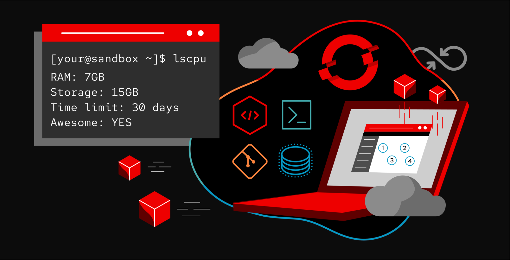
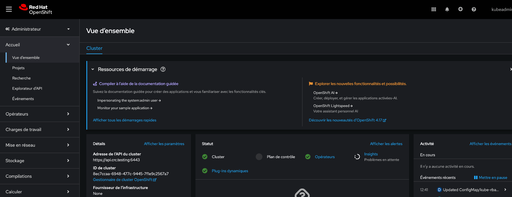
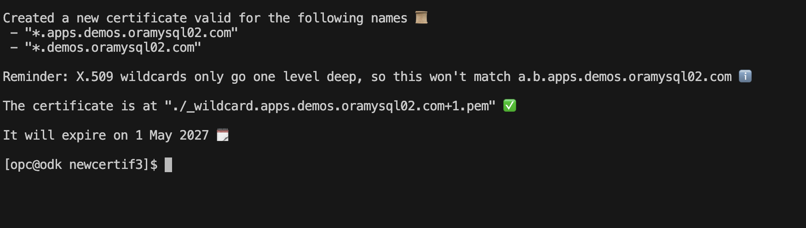
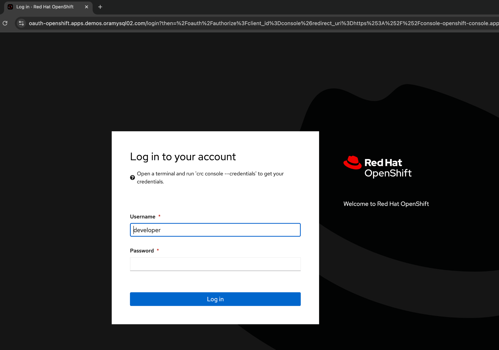

## Introduction

Red Hat OpenShift Container Platform is an enterprise Kubernetes platform that automates the deployment, scaling, and management of containerized applications across hybrid and multicloud environments. It offers features like built-in monitoring, logging, automated scaling, and continuous integration and continuous delivery (CI/CD) pipelines, empowering teams to deliver applications faster and with greater reliability. OpenShift supports a wide range of programming languages, frameworks, and databases, making it suitable for various workloads from traditional monolithic applications to cloud-native microservices architectures

Testing an OpenShift environment is not easy because it requires resources. However, fortunately, Red Hat offers a lightweight solution:

 - a local installation packaged with a VM (Red Hat CodeReady Container (CRC) ), or you can also create an [OpenShift Developer Sandbox](https://developers.redhat.com/learning/learn:openshift:foundations-openshift/resource/resources:openshift-and-developer-sandbox).


I won't detail the installation of OpenShift [here](https://developers.redhat.com/products/openshift-local/getting-started), we'll assume you have a working instance. You can find the installation guide here.
You will need to create a [Red Hat account](https://sso.redhat.com/auth/realms/redhat-external/protocol/openid-connect/auth?client_id=cloud-services&redirect_uri=https%3A%2F%2Fconsole.redhat.com%2Fopenshift%2Finstall&response_type=code&scope=openid+rhfull&nonce=a17be39c-cfe7-4c64-950a-ef3a5c912d9c&state=c3b5af91051e45888d3c04c4c350c4bc&response_mode=fragment)


## Requirements

The general requirements for CodeReady Containers are:

- OS: CentOS 7.5-9x/RHEL 7.5-9x/Fedora
- Login: Red Hat account (to obtain an authentication token)
-  Download: [pull-secret](https://cloud.redhat.com/openshift/install/crc/installer-provisioned?intcmp=701f20000012ngPAAQ)

The physical requirements include:

- Four virtual CPUs (vCPUs)
- 16 GB of memory (RAM)
- 100 GB of storage space

## ✅ Step 1: Prepare the OpenShift Environment

install package virt :
```bash

sudo dnf group install "Virtualization Host"

```

Setup package virt :
```bash

for drv in qemu network nodedev nwfilter secret storage interface; 
  do
   sudo systemctl enable virt${drv}d.service
   sudo systemctl enable virt${drv}d{,-ro,-admin}.socket;
   sudo systemctl start virt${drv}d{,-ro,-admin}.socket; 
  done

```

Installing the OpenShift CLI

You can install the OpenShift CLI (oc) either by downloading the binary or by using an RPM.
Navigate to the OpenShift Container Platform [downloads page](https://access.redhat.com/downloads/content/290/ver=4.17/rhel---9/4.17.14/x86_64/product-software) on the Red Hat Customer Portal.

Or direct download ,example for a linux amd64 platform :
```bash

wget https://mirror.openshift.com/pub/openshift-v4/x86_64/clients/ocp/stable/openshift-client-linux.tar.gz


```

Unpack the archive:
```bash

gunzip < openshift-client-linux.tar.gz |tar xv
sudo mv oc /usr/local/bin

```

Installing the crc CLI, example for a linux amd64 platform :
```bash

wget https://developers.redhat.com/content-gateway/file/pub/openshift-v4/clients/crc/2.46.0/crc-linux-amd64.tar.xz

```

Unpack the archive:
```bash

tar -xvf crc-linux-amd64.tar.xz
chmod +x crc-linux-2.46.0-amd64/crc
sudo mv crc-linux-2.46.0-amd64/crc /usr/local/bin
rm -r crc-linux-2.46.0-amd64

```

## ✅ Step 2: Set up and start the cluster

Setup , run the following command to configure CRC:
```bash

crc setup

```

Start, run the following command to start CRC:
```bash

crc start --cpus 4 --memory 16384 --disk-size 300 --pull-secret-file ~/redhat/pull-secret.txt

```

We are going to start our VM cluster with 4 CPUs, 16GB of memory, and a disk size of 300GB. In the command, we also specify the previously downloaded pull-secret file.

After a few minutes, our single-node cluster is ready 😀

```bash

... 
Started the OpenShift cluster.

The server is accessible via web console at:
  https://console-openshift-console.apps-crc.testing

Log in as administrator:
  Username: kubeadmin
  Password: XXXXXXXX

Log in as user:
  Username: developer
  Password: XXXXXXX

Use the 'oc' command line interface:
  $ eval $(crc oc-env)
  $ oc login -u developer https://api.crc.testing:6443


Started the OpenShift cluster.

The server is accessible via web console at:
  https://console-openshift-console.apps-crc.testing

Log in as user:
  Username: developer
  Password: xxxxxxxx
```

**📌 Log in to OpenShift:**

After installation get a credential :

```bash

crc console --credentials
To login as a regular user, run 'oc login -u developer -p developer https://api.crc.testing:6443'.
To login as an admin, run 'oc login -u kubeadmin -p XXXX-XXXX-XXXX-XXXX https://api.crc.testing:6443'

```

**📌 Ensure you have access to the OpenShift cluster and have the oc command-line tool installed and configured.**

```bash

oc login -u kubeadmin -p XXXX-XXXX-XXXX-XXXX https://api.crc.testing:6443
Login successful.

You have access to 68 projects, the list has been suppressed. You can list all projects with 'oc projects'

Using project "default".

```
The server is accessible via web console at:
  https://console-openshift-console.apps-crc.testing 

You can log in as an administrator with the user **'kubeadmin'** or as a user with the user **'developer'** (the default password is 'developer'). The administrator password is the one displayed by the previous command: XXXX-XXXX-XXXX-XXXX.  



## ✅ Step 3: Customization

This step is not necessary to use and test CRC; it’s only needed if you want a configuration that fits your environment.
By default, the DNS domain configured by the CRC installation is *crc.testing*. If you want to integrate this platform into your DNS, we will take the example of integration into the domain: *.demos.oramysql02.com*.

If you don’t have an official domain (like in my case) and you probably don’t want to buy a domain name or pay fees to a certificate authority just for local development, you will need a certificate authority. This is where [mkcert](https://github.com/FiloSottile/mkcert) comes in a simple tool for creating locally trusted development certificates that requires no configuration.

Requirements:

- [mkcert](https://github.com/FiloSottile/mkcert) binary
- OpenSSL
- A DNS server

**📌Step 1: Install mkcert.**
This step creates a local CA in your system truststore:
```bash

mkcert -install

```

Next, create a certificate signing request with the OpenShift default ingress wildcard domain. This typically follows the patterns: *.apps.demos.oramysql02.com and api.demos.oramysql02.com

To create a signed certificate that supports multiple domain names (including wildcards), we will use a configuration file that we will add to our OpenSSL command.

Create an OpenSSL configuration file, for example openssl.cnf :
```ini

[ req ]
default_bits       = 4096
distinguished_name = req_distinguished_name
req_extensions     = req_ext

[ req_distinguished_name ]
C = CH
ST = GVA
L = geneva
O = ora
OU = mysql
CN = *.apps.demos.oramysql02.com

[ req_ext ]
subjectAltName = @alt_names

[ alt_names ]
DNS.1 = *.apps.demos.oramysql02.com
DNS.2 = *.demos.oramysql02.com


```

Run the following command to create your CSR:
```bash

openssl req -out ingress.csr -new -newkey rsa:4096 -nodes -keyout ingresskey.pem -config openssl.cnf


```

The following files are created:

- ingress.csr - My certificate signing request.
- ingresskey.pem - The csr associated private key.

**📌Step 2: Sign the CSR with mkcert.**
This will produce your public key:
```bash

mkcert -csr ingress.csr

```



You're done with certificates!😀
By default, the files *rootCA.pem* and *rootCA-key.pem* are generated in the *$HOME/.local/share/mkcert/* directory.

Next, make sure your cluster is aware of the existence of your certificates. You will create secrets and patch your proxy and ingress controller.

**📌Step 3: Create your local rootCA configmap.**

```bash

oc create configmap oramysql021-ca --from-file=ca-bundle.crt=rootCA.pem  -n openshift-config

```

**📌Step 4: Create the secret containing your wildcard domain key pair.**

```bash
oc create secret tls oramysql021-cert --cert=_wildcard.apps.demos.oramysql02.com+1.pem --key=ingresskey.pem -n openshift-ingress

oc create secret tls oramysql021-cert --cert=_wildcard.apps.demos.oramysql02.com+1.pem --key=ingresskey.pem -n openshift-config

```
We will create the secret in the *openshift-ingress* and *openshift-config* namespaces.

**📌Step 5: Patch the default-route.**
```bash

export BASE_DOMAIN="demos.oramysql02.com"
oc patch -p "{\"spec\": {\"host\": \"default-route-openshift-image-registry.$BASE_DOMAIN\"}}" route default-route -n openshift-image-registry --type=merge


```


**📌Step 6 Patch both the default proxy and ingress controller, respectively.**
```bash

oc patch proxy/cluster --type=merge --patch='{"spec":{"trustedCA":{"name":"oramysql021-ca"}}}' && oc patch ingresscontrollers.operator.openshift.io default --type=merge -p '{"spec":{"defaultCertificate": {"name": "oramysql021-ce
rt"}}}' -n openshift-ingress-operator


```
  
**📌Step 7 Patch the default apiserver controller.**  
  
```bash

oc patch apiserver cluster --type=merge -p "{\"spec\":{\"servingCerts\": {\"namedCertificates\":[{\"names\":[\"api.${BASE_DOMAIN}\"],\"servingCertificate\": {\"name\": \"oramysql021-cert\"}}]}}}"
  
```

**📌Step 8 Patch the default openshift-authentication.**  
```bash

oc patch ingresses.config.openshift.io cluster --type=merge --patch-file=ingress-patch.yaml

```
Contents of ingress-patch.yaml : 
```yaml
spec:
  appsDomain: apps.demos.oramysql02.com
  componentRoutes:
  - hostname: console-openshift-console.apps.demos.oramysql02.com
    name: console
    namespace: openshift-console
    servingCertKeyPairSecret:
      name: oramysql021-cert 
  - hostname: oauth-openshift.apps.demos.oramysql02.com
    name: oauth-openshift
    namespace: openshift-authentication
    servingCertKeyPairSecret:
      name: oramysql021-cert 
```


> Since we just patched the different operators, we need to wait a few seconds for them to restart and apply the new configuration.

You can check their status by running the following command:
```bash

oc get clusteroperators
NAME                                       VERSION   AVAILABLE   PROGRESSING   DEGRADED   SINCE   MESSAGE
authentication                             4.17.10   True        False         False      4h53m   
config-operator                            4.17.10   True        False         False      24d     
console                                    4.17.10   True        False         False      5h12m   
control-plane-machine-set                  4.17.10   True        False         False      24d     
dns                                        4.17.10   True        False         False      4h53m   
etcd                                       4.17.10   True        False         False      24d     
image-registry                             4.17.10   True        False         False      4h52m   
ingress                                    4.17.10   True        False         False      24d     
kube-apiserver                             4.17.10   True        False         False      24d     
kube-controller-manager                    4.17.10   True        False         False      24d     
kube-scheduler                             4.17.10   True        False         False      24d     
kube-storage-version-migrator              4.17.10   True        False         False      5h37m   
machine-api                                4.17.10   True        False         False      24d     
machine-approver                           4.17.10   True        False         False      24d     
machine-config                             4.17.10   True        False         False      24d     
marketplace                                4.17.10   True        False         False      24d     
network                                    4.17.10   True        False         False      24d     
openshift-apiserver                        4.17.10   True        False         False      4h53m   
openshift-controller-manager               4.17.10   True        False         False      5h37m   
openshift-samples                          4.17.10   True        False         False      24d     
operator-lifecycle-manager                 4.17.10   True        False         False      24d     
operator-lifecycle-manager-catalog         4.17.10   True        False         False      24d     
operator-lifecycle-manager-packageserver   4.17.10   True        False         False      4h53m   
service-ca                                 4.17.10   True        False         False      24d 

```

And there you go, everything is set up 😀! Now we just need to test access from our workstation.

**📌Step 8: Test access.**

> Don’t forget to install the root CA certificate in your trust store on your workstation. The location may vary depending on the operating system you are using. It is useful in our case for command-line login with the oc login command.
> Alternatively, another solution is to replace the certificate authority in the system:admin kubeconfig with our CA certificate. You can find the procedure [here](https://access.redhat.com/solutions/6054981).

Let’s verify our HTTPS connection: https://console-openshift-console.apps.demos.oramysql02.com



Let’s verify our connection via the command line with oc login:

```bash

:> oc login -u kubeadmin -p XXXXXXXX https://api.demos.oramysql02.com:6443
Login successful.

You have access to 65 projects, the list has been suppressed. You can list all projects with 'oc projects'

Using project "default".

:> 
```

## And there you go, everything is working 😀! 

## Conclusion

This article showed you how to install CodeReady Containers (crc) and use mkcert to create and manage self-signed certificates for internal use. This solution is ideal for personal labs or small business test environments.
The next step is to deploy an application.

---
## References


[CRC Engineering docs](https://crc.dev/engineering-docs/)

[ CRC client](https://mirror.openshift.com/pub/openshift-v4/clients/crc/latest/)

[  How to replace the certificate authority for the installer system:admin kubeconfig ](  https://access.redhat.com/solutions/6054981)

[OpenShift Container Platform](https://docs.openshift.com/container-platform/4.17/welcome/index.html)

[Ingress Operator in OpenShift Container Platform ]( https://docs.openshift.com/container-platform/4.17/networking/networking_operators/ingress-operator.html)

[mkcert](https://github.com/FiloSottile/mkcert)

[RedHat download](https://access.redhat.com/downloads)


 
  